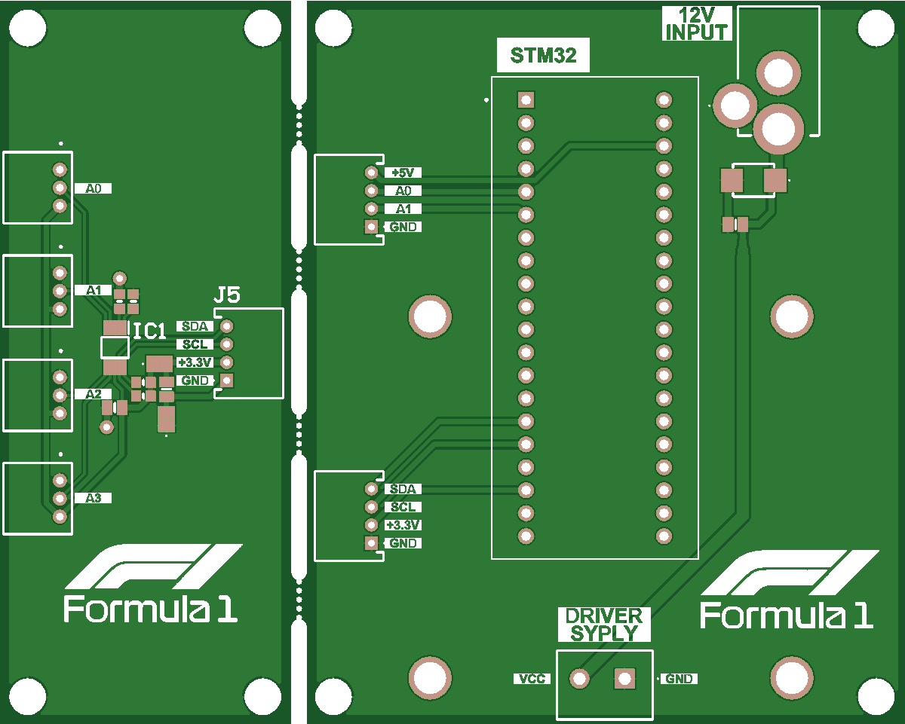
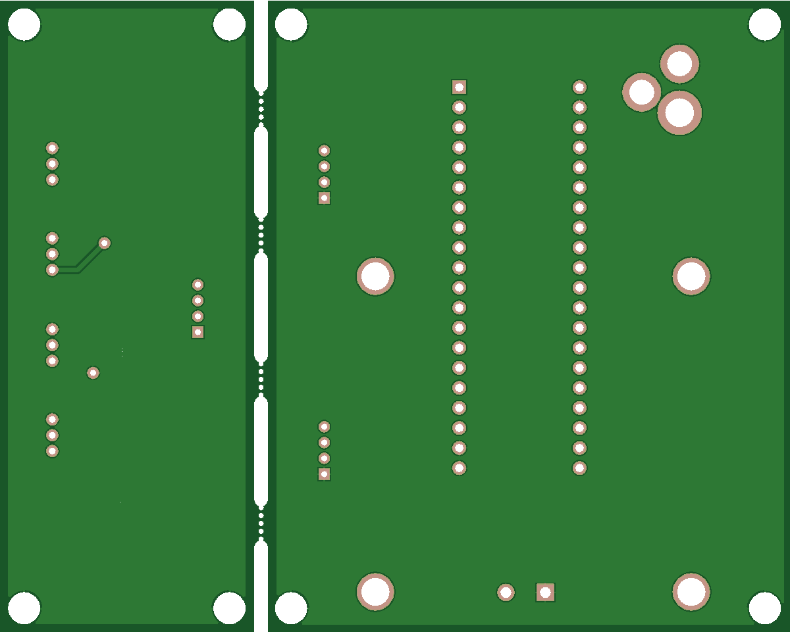

# Rasing-simulator

The **Racing Simulator** is a custom-built, high-fidelity car steering simulation platform for gaming enthusiasts. This project integrates mechanical, electronic, and software components into a single cohesive system, providing an authentic driving experience with realistic feedback.

## Features

- **Three-Pedal Set**:  
  Utilizes high-precision **500 kΩ potentiometers** as force sensors for the accelerator, brake, and clutch, delivering smooth analog input.

- **Force Feedback Steering**:  
  The steering system includes a robust **12V DC motor** controlled by a **BTS7960 motor driver** and a **chain transmission**, creating realistic force feedback and resistance during gameplay.

- **Steering Angle Detection**:  
  Employs an **incremental rotary encoder (38S6G5-B-G24N)** for precise steering angle measurement.

- **High-Resolution Analog Sensing**:  
  An **ADS1115 ADC module** with I2C communication reliably digitizes pedal signals for the microcontroller.

- **Microcontroller Platform**:  
  Powered by an **STM32F103C8T6 "Blue Pill"** board, running custom firmware based on the **FreeJoy platform** for real-time control and PC interface.

- **Custom Electronics**:  
  All circuitry was designed in **Altium Designer**, and two dedicated **custom PCBs** were fabricated: one for the pedal sensors and another for the steering feedback system.

- **Mechanical Design**:  
  Structural and moving parts were modeled and iterated in **Fusion 360** for optimal performance and durability.

- **Firmware Development**:  
  Advanced firmware was developed to enable force feedback, robust signal processing, and seamless USB connectivity with gaming PCs.

## Development Highlights

- **System Integration**:  
  Brought together mechanical, electronic, and software subsystems in a collaborative team environment.
- **Project Management**:  
  Leveraged **Gantt chart** scheduling to minimize delays and stay on track through each phase.
- **Prototyping & Iteration**:  
  Prototyped and tested all subsystems, refining both PCB layouts and mechanical designs to achieve final production quality.

## Gallery

### Custom PCB Top Side

### Custom PCB Bottom Side

---

> *This project deepened my expertise in cross-disciplinary engineering and embedded systems design, reinforcing the importance of precise project planning and teamwork in delivering complex hardware solutions.*

